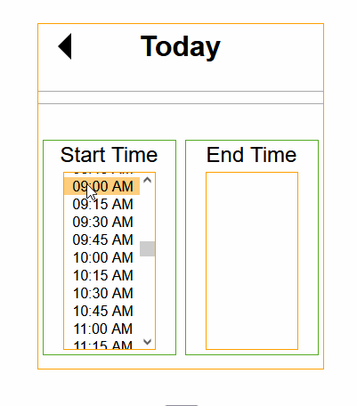

# Start time, End time Component

This is a specific sort of time range picker with start time and end time that must fall within the same day. It's useful for apps that need a time range such as a time keeping apps. 

Its designed to enter times very fast. You can use the mouse or keyboard up and down arrows to select from the drop down box.
It remembers the last End time and it becomes the Start time for the next entry.

It lets you visually see the time interval you've selected.
Times are chosen in 15 minute periods. For example, the start time can be at 8:00 AM, 8:15 AM, 8:30 AM or 8:45 AM.

You can choose the day, the current day is the default.
You can't choose any dates or times that are in the future.
You can't choose an end time that's before the start time.

Here is a screenshot:

If the date chosen is the current day, Start time is from midnight to the current time in 15 minute intervals. So if it's 10am, you can choose the start time from midnight to 10am.
If it's on any previous day, Start time is a list of all time intervals from midnight to 11:45 PM.

A time period can't span over more than one day. It must fall within that day.

If it's on the current day, End time lists all the times from the Start time chosen till the current time.
If it's on any previous day, End time lists all the times from the Start time chosen till 11:45 PM.

The height of the Start time and End time drop down list can be set in CSS. \
``
.times ul {
  height: 200px;
``

localStorage and a variable are used to remember the last End Time and that End Time is used as the next Start Time.

## Settings
Settings can be adjusted in *start-time-end-time.js* in the *settings* object.
* 24 hour time or hh:mm AM/PM format
* warnOver12Hrs - Boolean - Warns you if you've chosen a time period over 12 hours.

durationOverXHrs - Optionally warns you if End time minus Start time is over a certain period. The default is 10 hours. Set it to 0 to turn this warning off.
startTimeXHrsBeforeNow - Optionally warns you if the Start time chosen is a certain amount of hours before now (the time you are entering it). This option is handy to warn you that you are on the wrong day or you chose the PM time instead of AM. The default is 12 hours. Set it to 0 to turn this warning off. 
saveLastETInLocalStorage - Save the last entered End time into localStorage. If this setting is true, the next time you enter the times, the Start time is set to the last End time. The default is true.
hr24 - 24 hour time. The default is false.

