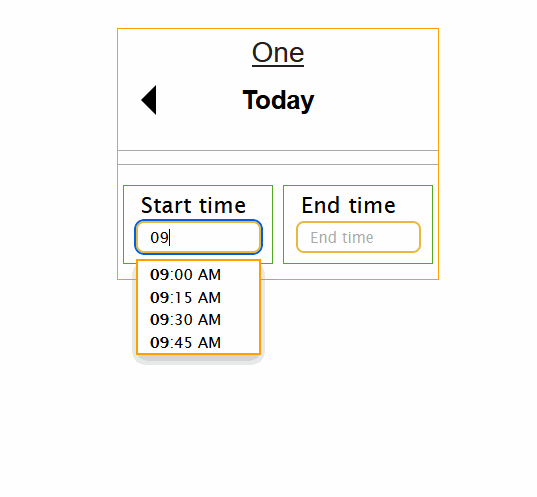

# Start time, End time Component

This is a specific sort of time range picker with start time and end time that
must fall within the same day. It's useful for apps that need a time range.

It's designed to enter times very fast. You can use the mouse or keyboard up and
down arrows to select from the drop down box. It remembers the last End time and
it becomes the Start time for the next entry.

It lets you visually see the time interval you've selected. Times are chosen in
15 minute periods. For example, the start time can be at 8:00 AM, 8:15 AM, 8:30
AM or 8:45 AM.

You can choose the day, the current day is the default. You can't choose any
dates or times that are in the future. You can't choose an end time that's
before the start time.
If the day is today, end time will only show the times up until now in 15 minute intervals.

Here is a screenshot:



If the date chosen is the current day, Start time is from midnight to the
current time in 15 minute intervals. So if it's 10am, you can choose the start
time from midnight to 10am. If it's on any previous day, Start time is a list of
all time intervals from midnight to 11:45 PM.

A time period can't span over more than one day. It must fall within that day.

If it's on the current day, End time lists all the times from the Start time
chosen till the current time. If it's on any previous day, End time lists all
the times from the Start time chosen till 11:45 PM.

localStorage and a variable are used to remember the last End Time and that End
Time is used as the next Start Time.

<br><br>

## How to get started
```
<link rel="stylesheet"href="https://cdn.rawgit.com/chrisjwaddell/Drop-down-field/main/dist/style/dropdown-field.css">
<link rel="stylesheet"href="https://cdn.rawgit.com/chrisjwaddell/start-time-end-time-component/main/style/start-time-end-time.css">


<script src="https://cdn.rawgit.com/chrisjwaddell/start-time-end-time-component/main/scripts/utils.js"></script>
<script src="https://cdn.rawgit.com/chrisjwaddell/Drop-down-field/main/dist/scripts/dropdown-field.js"></script>
<script src="https://cdn.rawgit.com/chrisjwaddell/start-time-end-time-component/main/scripts/start-time-end-time.js"></script>


```

Add something like this into your javascript file:

```
let times = STET(".times", "Times", "Times", 1, {
	autofocus: true,
	STClickCallback: () => {
		onChangeST()
	},
	ETClickCallback: () => {
		onChangeET()
	},
})
```

The mandatory settings are:
\
target - where the drop down field gets placed.\
STETId - a unique id for this start time, end time component.\
STETTitle - Title added at the top of the component.\
STtabindex - tab index.

<br><br>

## Settings

Settings can be adjusted in the _StetSettings_ array. It takes an array of
settings, if you have two _Start time end time_ components, you can have two
objects in the array.

<br>

### Properties

| Properties                     | Description
| -------------------------- | --------------------------------------------------------------------------------------------------------------------------------------------------------------------------------------------------------------------------------------------------------------------------------------- |
| `durationOverXHrs`         | Optionally warns you if End time minus Start time is over a certain period. Set it to 0 to turn this warning off. The default is _10_.                                                                                                                                                  |
| `startTimeXHrsBeforeNow`   | Optionally warns you if the Start time chosen is a certain amount of hours before now (the time you are entering it). This option is handy to warn you that you are on the wrong day or you chose the PM time instead of AM. Set it to 0 to turn this warning off. The default is _10_. |
| `saveLastETInLocalStorage` | Save the last entered End time into localStorage. If this setting is true, the next time you enter the times, the Start time is set to the last End time. The default is _true_. | 
| `hr24` | 24 hour time or hh:mm AM/PM format. The default is _false_. | 
| `autofocus` | Start time gets the focus on page load. The default is _false_. | 
| `STTitle` | Title of Start time list. The default is _Start time_. |
| `ETTitle` | Title of End time list. The default is _End time_. | 

Warnings go into the *warnings* property of the *getResults* method. 
You may be on yesterday, choose a time and forget to change to today, it can warn you in those cases.

When the warnings string isn't empty, the CSS class *stet-warnings* is added to the Start time and End time input boxes. The default *.stet-warnings* setting is to make the background red. To change these settings, change this CSS class.


<br>

### Methods

| Method                     | Description                                                                                                |
| ------------------------------- | --------------------------------------------------------------------------------------------------------------------------------------------------------------------------------------------------------------------------------------------------------------------------------- |
| `getResult(refresh)`   | This returns an object. The *warnings* property has a warnings string (set by *durationOverXHrs* and *startTimeXHrsBeforeNow* optional warnings). It also has a *required* property which has a description of what fields are missing. *durationText*, *durationDecimal* and some other handy properties. If the *refresh* parameter is set to *true*, the Start time and End time are reset, Start time becomes the previous End time, if this option is set via the *saveLastETInLocalStorage* option. Refresh is generally used in adding something with that time range. |

This is an example of what *getResults* returns:
```
Object { 
    day: -1, 
    st: "08:00 AM", 
    et: "08:00 PM", 
    required: "", 
    stFilledIn: true, 
    etFilledIn: true, 
    stetFilledIn: true, 
    durationText: "12 hrs", 
    durationDecimal: 12, 
    warnings: "The Start time was 17 hours ago.\nThis is over 10 hours.\n"
}
```

<br>

### Callbacks

| Callbacks                     | Description                                                                                                |
| ------------------------------- | --------------------------------------------------------------------------------------------------------------------------------------------------------------------------------------------------------------------------------------------------------------------------------- |
| `STClickCallback`         | This takes a callback function that runs after the Start time field changes. You could use the *getResults()* function to display the results.                                                                                                                                                 |
| `ETClickCallback`         | This takes a callback function that runs after the End time field changes. You could use the *getResults()* function to display the results.                                                                                                                                                 |

<br> <br>
